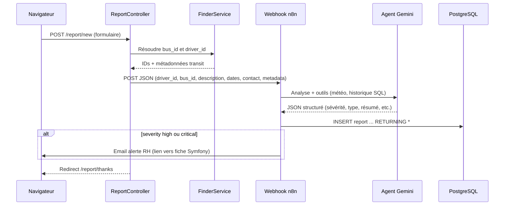

# Résumé technique du projet

## Stack et déploiement local

- **Backend** : Symfony 8, PHP ≥ 8.4, Doctrine ORM, PostgreSQL (service `database` dans [compose.yaml](../compose.yaml)).
- **Front** : Twig, AssetMapper, Stimulus, Turbo ([composer.json](../composer.json)).
- **Outils** : Adminer (port 8080), **n8n** (port 5678) sur le même réseau Docker `app` — l’URL typique du webhook en dev est `REPORT_WEBHOOK_URL` (ex. dans `.env` : `http://localhost:5678/webhook/signalement`).

## Modèle métier principal

L’entité [`Report`](../src/Entity/Report.php) représente un signalement : liaison **obligatoire** à un [`Driver`](../src/Entity/Driver.php) et un [`Bus`](../src/Entity/Bus.php), champs texte (description, type de situation, sévérité, contextes aggravant/atténuant, résumé, crédibilité), **JSONB** pour `reporter_contact` et `metadata`, dates (`created_at`, `report_date`, `incident_date`), et côté gestion : clôture (`closed_at`, `closure_reason`, `closed_by`).

Des entités **transit** ([`TransitLine`](../src/Entity/TransitLine.php), [`TransitStop`](../src/Entity/TransitStop.php), [`TransitDirection`](../src/Entity/TransitDirection.php), [`BusServing`](../src/Entity/BusServing.php)) alimentent la résolution « ligne / arrêt / direction → bus ».

## Résolution bus / conducteur ([`FinderService`](../src/Service/FinderService.php))

- Par **identifiant bus prérempli** (query `busId`) ou par **ligne + arrêt + direction** + horaire du trajet : recherche dans les tables transit / `BusServing`, avec repli déterministe « aléatoire » si la combinaison ne matche pas (comportement de démo).
- Les endpoints AJAX du formulaire (`/report/new/find-bus`, suggestion transit) sont **publics** et protégés par jeton CSRF ([security.yaml](../config/packages/security.yaml) + [`ReportController`](../src/Controller/ReportController.php)).

## Parcours « formulaire public » et lien avec n8n

Points importants côté code ([`ReportController::new`](../src/Controller/ReportController.php)) :

- Le traitement valide le formulaire, **impose** `REPORT_WEBHOOK_URL`, résout bus/conducteur, construit un **payload JSON** (`description`, `report_date`, `incident_date`, `reporter_contact`, `metadata` avec transit et `source: formulaire`), puis **POST vers n8n** (timeout 15 s). **Aucun `persist` du `Report` dans ce flux** : la ligne en base est créée par n8n.
- Succès HTTP 2xx → redirection vers [`/report/thanks`](../templates/report/thanks.html.twig).

## Workflow n8n (alignement)

1. **Webhook POST** `signalement` reçoit le corps (équivalent au `body` attendu par n8n après réception depuis Symfony).
2. **Agent LangChain** + **Gemini** : prompt « expert RH » avec schéma JSON (sévérité, type de situation, contextes, crédibilité, résumé, `suggested_closure_reason`, etc.).
3. **Outils** : mémoire session (clé `driver_id`), **OpenWeatherMap** (contexte incident), **Postgres tool** pour l’historique (le prompt demande d’analyser les signalements passés du conducteur).
4. **Structured Output Parser** : sortie JSON contrôlée.
5. **Nœud Postgres** : `INSERT INTO report (...)` avec valeurs issues de la sortie structurée de l’agent, `RETURNING *` — c’est ce qui alimente la **même base** que Symfony.
6. **IF** sur `severity` ∈ `{high, critical}` → **email SMTP** avec lien vers la fiche signalement Symfony (`/report/{id}`, `id` issu du `RETURNING` après insert).

**Note d’alignement** : le schéma agent peut utiliser la clé `aggraving_context` (faute d’orthographe) ; l’API Symfony accepte aussi ce alias ([`ApiReportController`](../src/Controller/Api/ApiReportController.php)). Vérifier que l’expression SQL n8n mappe bien vers la colonne `aggravating_context` en base et que la sortie de l’agent expose la même clé que celle utilisée dans le modèle SQL.

## Autre voie d’écriture : API REST

[`POST /api/reports`](../src/Controller/Api/ApiReportController.php) crée un signalement **directement via Doctrine** (sans passer par n8n), avec validation des champs requis. D’après [security.yaml](../config/packages/security.yaml), les routes sous `/` non listées en `PUBLIC_ACCESS` exigent **`ROLE_USER`** : l’API est donc destinée aux utilisateurs **connectés**, pas au grand public.

## Interface de gestion

- **Dashboard** ([`DashboardController`](../src/Controller/DashboardController.php), route `/`) : stats, tendances, conducteurs à risque, derniers signalements (agrégations dans [`ReportRepository`](../src/Repository/ReportRepository.php)).
- **Liste / fiche signalement** : [`ReportController::index`](../src/Controller/ReportController.php), `show` avec détail enrichi repository ; **clôture / brouillon de raison** réservées à **`ROLE_MANAGER`** ou **`ROLE_ADMIN`** (mêmes règles pour `saveClosureReason` et `close`).
- **Conducteurs** : [`DriverController`](../src/Controller/DriverController.php) pour la fiche et l’historique.

## Sécurité (aperçu)

- Authentification formulaire custom [`LoginFormAuthenticator`](../src/Security/LoginFormAuthenticator.php).
- Pages publiques explicites : login, logout, assets, **`/report/new`** (+ endpoints find-bus / transit-suggest), **`/report/thanks`**. Le reste nécessite au minimum un utilisateur connecté.

---

En une phrase : **le cœur métier est un CRM de signalements sur PostgreSQL ; le formulaire citoyen envoie les faits bruts à n8n qui enrichit par IA, insère la ligne `report`, et peut alerter par mail si la gravité est élevée, tandis que Symfony sert la résolution transit, l’UI de consultation/clôture et une API optionnelle d’insertion directe.**
